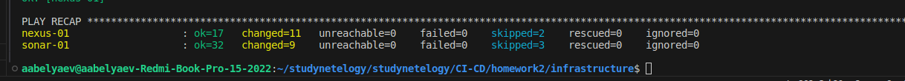
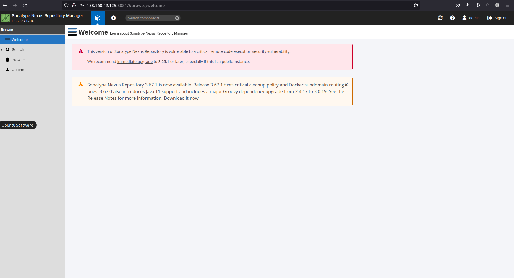

# Автор: Федорчук Дмитрий Сергеевич DEVOPS-33

# Домашнее задание к занятию «Процессы CI/CD»

## Подготовка к выполнению

1. Создал две VM в Yandex Cloud с параметрами: 2CPU 4RAM Centos7. Для создания использовал Terraform,
  {
    "ip_external" = "158.160.49.125"
    "ip_internal" = "10.0.1.30"
    "name" = "centos7-1"
  },
  {
    "ip_external" = "62.84.118.206"
    "ip_internal" = "10.0.1.8"
    "name" = "centos7-2"
  }
2. Запустил playbook, дождался успешного завершения:

5. Открыл браузер, проверил готовность SonarQube через браузер:

6. Зашел под admin\admin, поменял пароль на свой.
7. Проверил готовность Nexus через бразуер:

8. Подключился под admin\admin123, поменял пароль, сохранил анонимный доступ.

## Знакомоство с SonarQube

### Основная часть

1. Создайте новый проект, название произвольное.
2. Скачайте пакет sonar-scanner, который вам предлагает скачать SonarQube.
3. Сделайте так, чтобы binary был доступен через вызов в shell (или поменяйте переменную PATH, или любой другой, удобный вам способ).
4. Проверьте `sonar-scanner --version`.
5. Запустите анализатор против кода из директории [example](./example) с дополнительным ключом `-Dsonar.coverage.exclusions=fail.py`.
6. Посмотрите результат в интерфейсе.
7. Исправьте ошибки, которые он выявил, включая warnings.
8. Запустите анализатор повторно — проверьте, что QG пройдены успешно.
9. Сделайте скриншот успешного прохождения анализа, приложите к решению ДЗ.

### Решение основной части

1. Создал новый проект, назвал ProjectX.

2. Sonar-scanner предлагает скачать пакет. Скачиваю его и размещаю в директории загрузок, выбор директории будет не важен.

3. Чтобы бинарник Sonar-scanner был доступен, добавляю его в переменную PATH.

4. Проверяю вывод команды `sonar-scanner --version`:

5. Запускаю анализатор кода с дополнительным ключом:

После анализа получаю ссылку на дашборд с результатом анализа:

6. Смотрю результат в интерфейсе, вижу, что есть 2 бага и 1 Code Smells:

7. Исправляю ошибки.

8. Заново запускаю анализатор, вижу, что ошибок и предупреждений нет.

9. Скриншот успешного прохождения анализа:

## Знакомство с Nexus

### Основная часть

1. В репозиторий `maven-public` загрузите артефакт с GAV-параметрами:

 *    groupId: netology;
 *    artifactId: java;
 *    version: 8_282;
 *    classifier: distrib;
 *    type: tar.gz.
   
2. В него же загрузите такой же артефакт, но с version: 8_102.
3. Проверьте, что все файлы загрузились успешно.
4. В ответе пришлите файл `maven-metadata.xml` для этого артефекта.

### Решение основной части

1. В репозиторий `maven-public` загружаю артефакт с указанными параметрами:

2. Загружаю такой же артефакт, но с версией 8_102.

3. Через Browse, проверяю содержимое репозитория `maven-public`, вижу, что все файлы загрузились успешно:

4. [Ссылка на maven-metadata.xml](https://github.com/DemoniumBlack/fedorchukds-devops-33-23/blob/main/SRC/maven-metadata.xml)

### Знакомство с Maven

### Подготовка к выполнению

1. Скачал дистрибутив с maven.
2. Разархивировал, добавил путь к бинарнику в переменную PATH.
3. Удалил из `settings.xml` упоминание о правиле, отвергающем HTTP-соединение.
4. Проверяю `mvn --version`:

5. Скачал файл pom.xml из директории mvn.

### Основная часть

1. Поменяйте в `pom.xml` блок с зависимостями под ваш артефакт из первого пункта задания для Nexus (java с версией 8_282).
2. Запустите команду `mvn package` в директории с `pom.xml`, ожидайте успешного окончания.
3. Проверьте директорию `~/.m2/repository/`, найдите ваш артефакт.
4. В ответе пришлите исправленный файл `pom.xml`.

### Решение основной части

1. Поменял в `pom.xml` блок с зависимостями под мой артефакт из первого пункта задания для Nexus (java с версией 8_282):

2. Запустил команду `mvn package` в директории с `pom.xml`, дождался успешного окончания выполнения команды:

3. Проверяю содержимое `~/.m2/repository/`. Артефакт найден:

4. Исправленный файл `pom.xml`: [ссылка](https://github.com/DemoniumBlack/fedorchukds-devops-33-23/blob/main/SRC/pom.xml)

---
