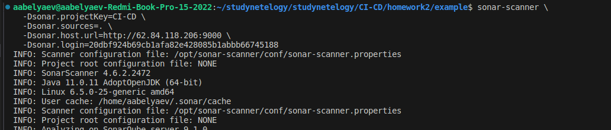

# Автор: Федорчук Дмитрий Сергеевич DEVOPS-33

# Домашнее задание к занятию «Процессы CI/CD»

## Подготовка к выполнению

1. Создал две VM в Yandex Cloud с параметрами: 2CPU 4RAM Centos7. Для создания использовал Terraform,
  {
    "ip_external" = "158.160.49.125"
    "ip_internal" = "10.0.1.30"
    "name" = "centos7-1"
  },
  {
    "ip_external" = "62.84.118.206"
    "ip_internal" = "10.0.1.8"
    "name" = "centos7-2"
  }
2. Запустил playbook, дождался успешного завершения:

5. Открыл браузер, проверил готовность SonarQube через браузер:

6. Зашел под admin\admin, поменял пароль на свой.
7. Проверил готовность Nexus через бразуер:

8. Подключился под admin\admin123, поменял пароль, сохранил анонимный доступ.

## Знакомоство с SonarQube

1. Проверяем sonar-scanner --version: 

2. 

3. В интерфейсе есть 2 бага и 1 Code Smells:

4. Испарвил ошибки

## Знакомство с Nexus

### Основная часть

1. В репозиторий `maven-public` загрузите артефакт с GAV-параметрами:

 *    groupId: netology;
 *    artifactId: java;
 *    version: 8_282;
 *    classifier: distrib;
 *    type: tar.gz.
   
2. В него же загрузите такой же артефакт, но с version: 8_102.
3. Проверьте, что все файлы загрузились успешно.
4. В ответе пришлите файл `maven-metadata.xml` для этого артефекта.

### Решение основной части

1. Загрузил артефакты с указанными параметрами:

2. [Ссылка на maven-metadata.xml](https://github.com/aabelyaev/studynetelogy/blob/main/CI-CD/homework2/infrastructure/maven-metadata.xml)

### Знакомство с Maven

### Подготовка к выполнению

1. Скачал дистрибутив с maven.
2. Разархивировал, добавил путь к бинарнику в переменную PATH.
3. Удалил из `settings.xml` упоминание о правиле, отвергающем HTTP-соединение.
4. Проверяю `mvn --version`:
    Apache Maven 3.9.0

### Решение основной части

1. Исправленный файл `pom.xml`: [ссылка](https://github.com/aabelyaev/studynetelogy/blob/main/CI-CD/homework2/infrastructure/mvn/pom.xml)

---
