# Домашнее задание к занятию 11 «Teamcity»

## Подготовка к выполнению

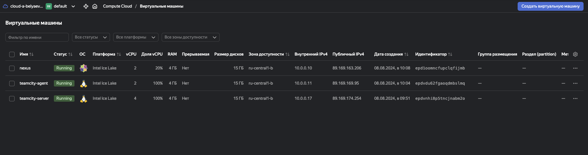

## Основная часть
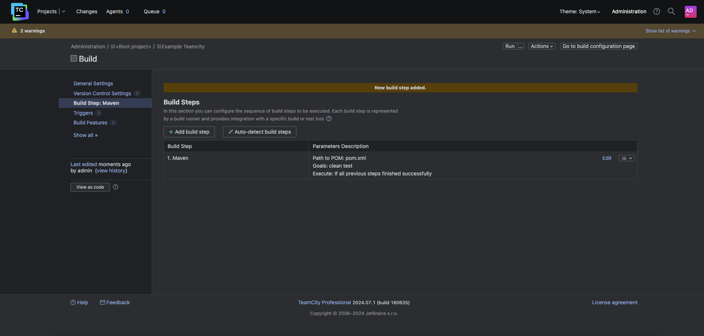
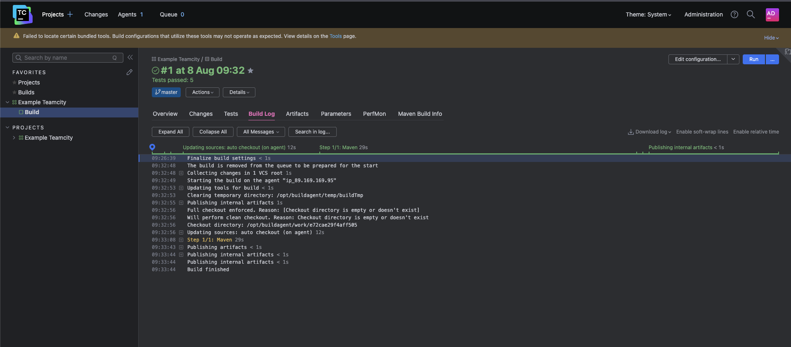
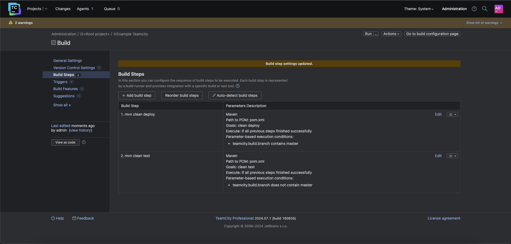
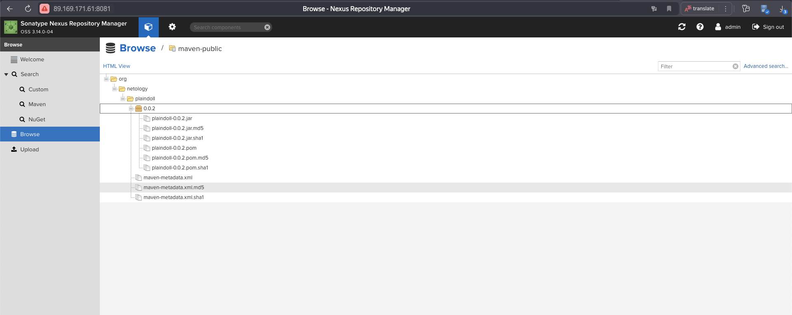
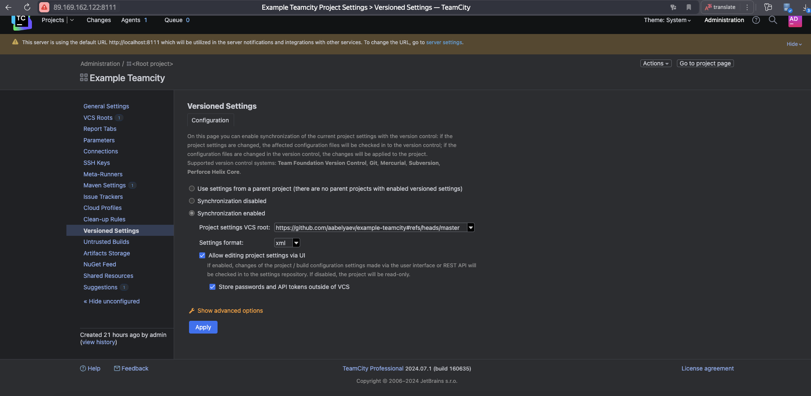
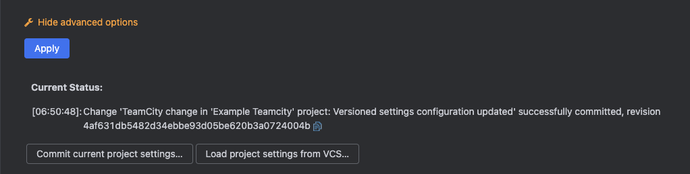
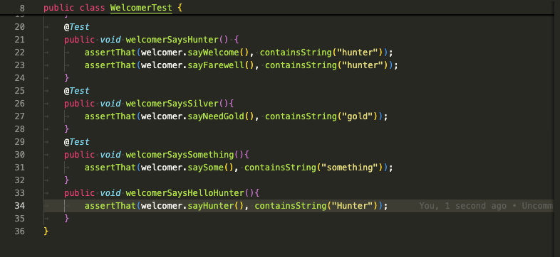
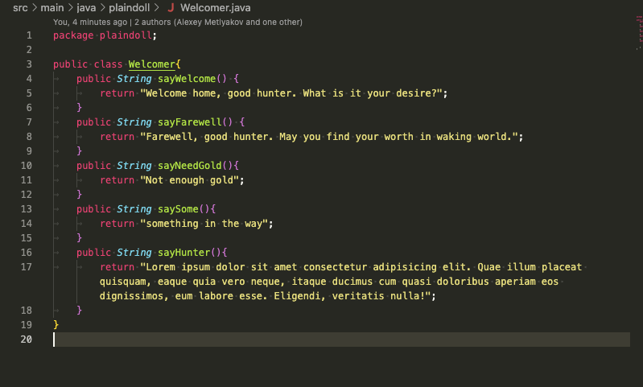

12. Сделал push всех изменений в новую ветку репозитория.

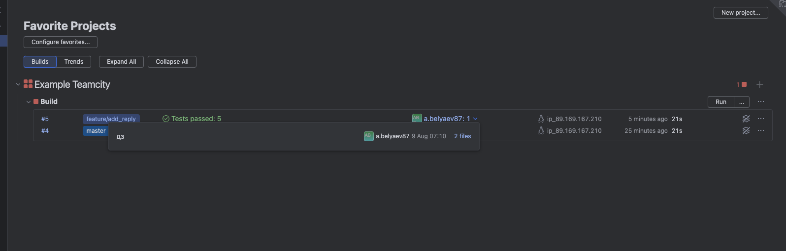

13. Убедитесь, что нет собранного артефакта в сборке по ветке master.

17. Проведите повторную сборку мастера, убедитесь, что сборка прошла успешно и артефакты собраны.
18. Проверьте, что конфигурация в репозитории содержит все настройки конфигурации из teamcity.

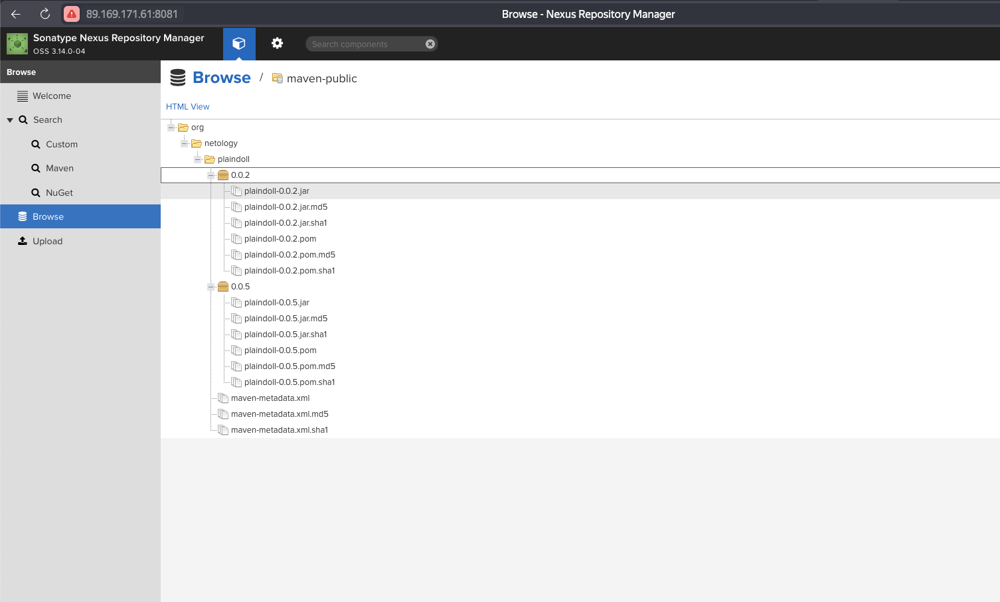
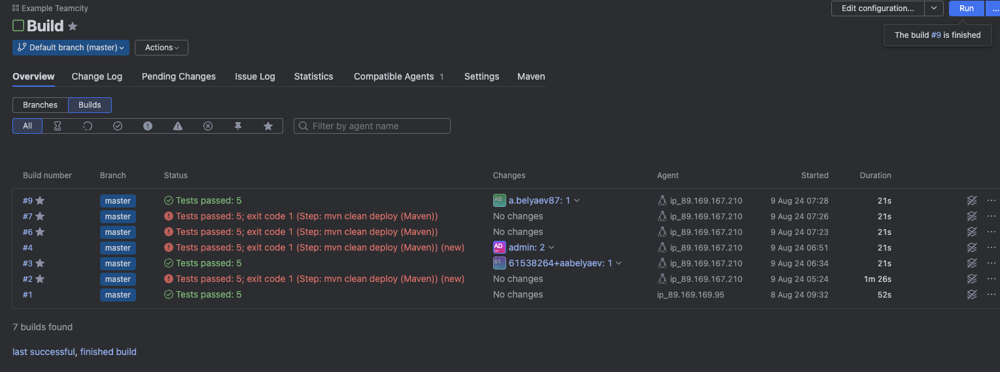

